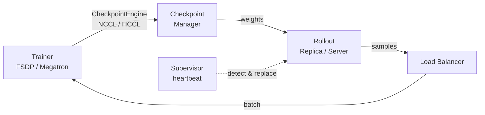

# Recipe: Elastic Rollout with Training-Inference Separation

## Design

[Summary Design](DESIGN.md) · [RFC](https://github.com/verl-project/verl/discussions/4381)

## Solution



## Support

algorithm

- [x] ppo
- [x] grpo

rollout

- [x] vllm
- [ ] sglang
- [ ] trtllm

train

- [x] megatron
- [x] fsdp

## Features

- **fully-async policy** - a `FullyAsyncRollouter` continuously generates samples into a `MessageQueue`, and the `FullyAsyncTrainer` consumes them asynchronously.
- **one-step-off policy** - a `OneStepOffRayTrainer` generates the samples needed for the next training iteration while the current iteration is training.
- **checkpoint engine** - fast, fault-tolerant weight sync from trainer to rollout replicas (NCCL/HCCL backends).
- **fault tolerance** - supervisor heartbeat, dead-replica replacement, weight-sync retry, and token continuation.

## Quickstart

Mount this module inside your verl install (e.g. copy `experimental/fully_async_policy` to `verl/experimental/...`), or add this repo to `PYTHONPATH` so the `verl.experimental` imports resolve, then:

```bash
# fully-async
python3 -m verl.experimental.fully_async_policy.fully_async_main \
    --config-path=config --config-name='fully_async_ppo_trainer' \
    actor_rollout_ref.model.path=<MODEL_PATH> \
    data.train_files=<TRAIN_FILES> \
    rollout.n_gpus_per_node=8

# one-step-off
python3 -m verl.trainer.main_ppo \
    --config-path=config --config-name='one_step_off_ppo_trainer' \
    actor_rollout_ref.model.path=<MODEL_PATH> \
    data.train_files=<TRAIN_FILES> \
    trainer.trainer_fn=verl.experimental.one_step_off_policy.ray_trainer.OneStepOffRayTrainer
```

## Configuration

```yaml
async_training:
  # fully-async: max sample staleness allowed before generation pauses
  staleness_threshold: 0.1
  # sync weights from trainer every N consumed batches
  trigger_parameter_sync_step: 4
  # number of ppo_mini_batches consumed per sync
  require_batches: 1
  # resume interrupted generation after weight sync
  partial_rollout: True
  # elastic fault recovery
  fault_tolerance:
    enabled: False
    heartbeat_interval_s: 5.0
    heartbeat_miss_threshold: 3
    max_weight_sync_retries: 2
actor_rollout_ref:
  rollout:
    # standalone async rollout
    mode: async
    calculate_log_probs: True
    checkpoint_engine:
      backend: "nccl"   # nccl / hccl
algorithm:
  rollout_correction:
    bypass_mode: True
```

## FAQ

- **Q: What does "elastic" mean here?** A: the rollout tier is disaggregated from training, so replicas can be added, removed, or restarted (scale up/down and fault recovery) without stopping the trainer.
- **Q: Which config to start from?** A: use `fully_async_ppo_megatron_trainer.yaml` / `fully_async_ppo_trainer.yaml` for fully-async, and `one_step_off_ppo_megatron_trainer.yaml` / `one_step_off_ppo_trainer.yaml` for one-step-off.
- **Q: How to enable fault tolerance?** A: set `async_training.fault_tolerance.enabled=True` and optionally enable token continuation via `fault_tolerance.progress.enabled=True`.
